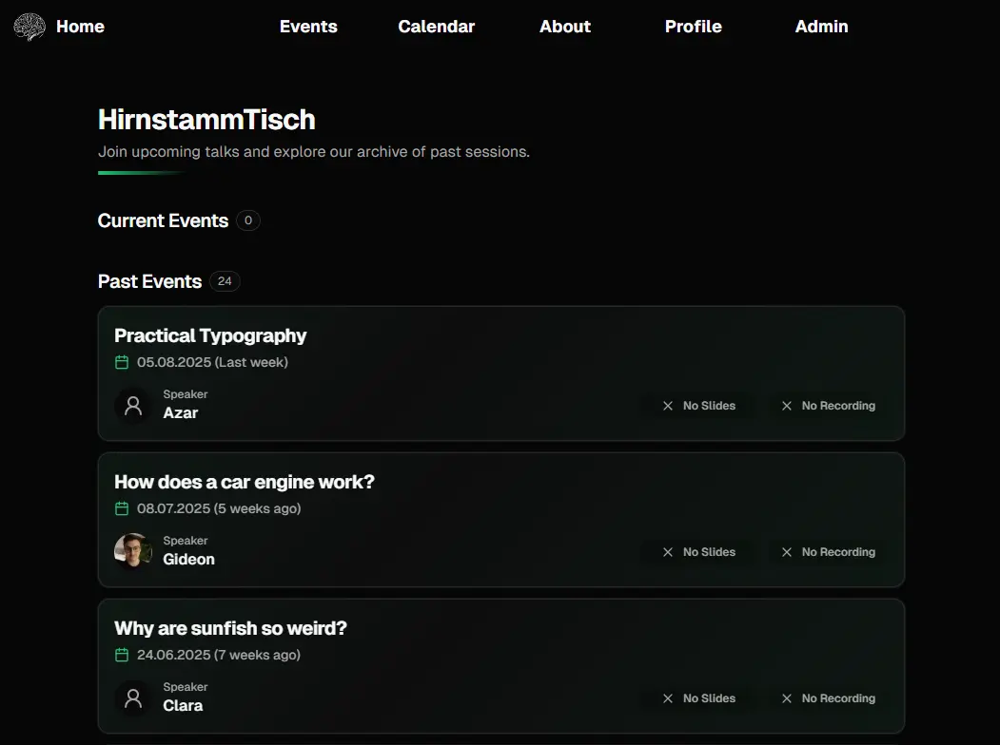

# HirnStammtisch

A small community site to propose, schedule, and browse discussion sessions.

## Screenshot



## Stack
- Next.js 15, React 19
- TRPC, Drizzle ORM (Postgres)
- Better Auth (email/password + Google)
- UploadThing (assets)
- Tailwind CSS 4, Serwist (PWA), Plausible analytics

## Quick start
1. Install pnpm 10.x and Node 22.x
2. Install deps:
   ```bash
   pnpm install
   ```
3. Configure env:
   ```bash
   cp .env.example .env.local
   ```
   Fill values (see below).
4. Create a Postgres database and run schema:
   ```bash
   pnpm db:push
   ```
5. Start dev server:
   ```bash
   pnpm dev
   ```

## Environment variables
See `.env.example` for all variables. Required:
- `SITE_URL` — public base URL
- `DATABASE_URL` — Postgres connection string
- `BETTER_AUTH_SECRET` — long random string
- `BETTER_AUTH_URL` — base URL for auth callbacks (usually `http://localhost:3000` locally)
- `GOOGLE_CLIENT_ID`, `GOOGLE_CLIENT_SECRET` — for Google OAuth
- `UPLOADTHING_TOKEN` — UploadThing server token

Optional: `PORT`, `NODE_ENV`, `VERCEL_URL`, `SKIP_ENV_VALIDATION`.

## License
MIT — see `LICENSE`.
